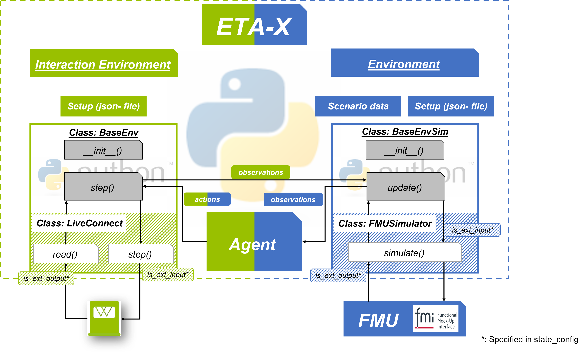

.. _envs:

Common Environment Functions
===============================
The following are some common utilities that can be used to simplify the creation of environments.

Base Environment
------------------

.. automodule:: eta_utility.eta_x.envs.base_env
  :members:
  :private-members:

Base Environment MPC
----------------------
For the parameters to be transferred, see class: :class:`BaseEnv`.

.. automodule:: eta_utility.eta_x.envs.base_env_mpc
    :members:
    :private-members:

Base Environments Simulation
-----------------------------
In addition to the required parameters from class Base Environment, the fmu name must also be transferred.
See also :func:`fmu_name`.

    - **fmu_name** : Name of the fmu model

For all other parameters see class: :class:`BaseEnv`.

.. automodule:: eta_utility.eta_x.envs.base_env_sim
    :members:
    :private-members:

Interaction between Environments
-----------------------------------

For interaction between environments, additional parameters have to set in the configuration file (see also: :class:`eta_x`).

For the *setup* section:

    - **interaction_env_package**: (str) Path of the interaction environment
    - **interaction_env_class**: (str) Name of the interaction environment class

For the *settings* section:

    - **interact_with_env**: (bool) True for interaction between environments