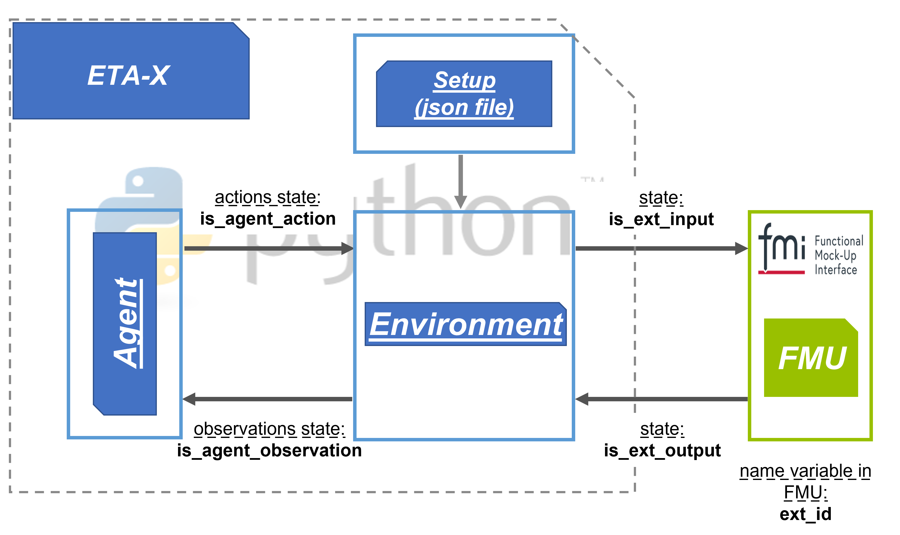

.. _eta_x:

ETA-X
=========================

ETA X

Stable baselines
------------------
Much of the ETA-X functionality is based on OpenAI stable baselines.
Look `here <https://stable-baselines.readthedocs.io/en/master/index.html>`_.

Configuration file parameters
---------------------------------

This is an overview of most configuration parameters that can be interpreted by ETAi, the agents
and environments. The config file should be in json format and contain multiple sections:

  - **setup**: This section specifies which classes and utilities should be used for optimization
  - **paths**: In this section the file paths for results and scenarios are specified
  - **settings**: The settings section contains basic parameters for the optimization, such as duration
  - **environment_specific**: The environment section contains data that is required by the environment
  - **agent_specific**: The agent section contains data that is required by the agent

The json file is a dictionary and the following parameters are required settings:

For the *setup* section:

    - **environment_package**: (str) Path of the environment
    - **environment_class**: (str) Name of the environment class
    - **agent_package**: (str) Path of the agent
    - **agent_class**: (str) Name of the agent class

For the *paths* section:

    - **relpath_results**: (str) Relative path to results (from repository root directory)

Other sections don't have required settings. The following parameters will be allowed to
set in the sections.

In the *setup* section there are the following parameters:

  - **vectorizer_package**: (str) Package for the environment vectorizer (i.e.: "stable_baselines.common.vec_env.dummy_vec_env")
  - **vectorizer_class**: (str) Class for the environment vectorizer (i.e.: "DummyVecEnv")
  - **policy_package**: (str) Policy Package
  - **policy_class**: (str) Policy class
  - **monitor_wrapper**: (bool) Add a monitoring wrapper to the environments
  - **norm_wrapper_obs**: (bool) Add an auto-normalization wrapper for observations (side note: normalization in environments might be possible?)
  - **norm_wrapper_reward**: (bool) Add auto-normalization wrapper for rewards (side note: normlization in environment might be possible?)
  - **norm_wrapper_clip_obs**: (float) Clip value for observations in auto-normalization wrapper
  - **tensorboard_log**: (bool) Enable/disable tensorboard logging

In the *paths* section there are the following parameters:

  - **relpath_scenarios**: (str) Relative path to scenarios (from repository root directory)

In the *settings* section there are the following parameters:

  - **sampling_time**: (int) Sampling time / simulation step size / resolution [seconds] - new state values will be acquired each interval specified by sampling_time
  - **control_interval**: (int) Control interval [quantity] - new action values will be set each {sampling_rate}*{control_interval}
  - **episode_duration**: (int) Episode duration [seconds]
  - **n_episodes_learn**: (int) Number of episodes for learning [quantity]
  - **n_episodes_play**: (int) Number of episodes for playing [quantity]
  - **n_environments**: (int) Number of parallel environment instances to interact with agent during learning (always 1 for play)[quantity]

Parameters in the *environment_specific* section are currently not completely documented here. They are very
dependent on the specific environment. Some of the available parameters (for some/most environments) are:

  - **seed**: (int) Random seed for the environment
  - **scenario_time_begin**: Date YYYY-MM-DD HH:MM (will be rounded to nearest 15-min interval)
  - **scenario_time_end**: Date YYYY-MM-DD HH:MM (will be rounded to nearest 15-min interval)
  - **scenario_csv_weather**: (str) Name of the weather scenario csv file (just filename, i.e.: "weather.csv")
  - **discretize_state_space**: (bool) When True state space will be Discrete instead of Box
  - **discretize_action_space**: (bool) When True action space will be Discrete instead of Box
  - **n_action_disc_steps**: (int) Number of discrete action steps if "discretize_action_space" is True
  - **normalize_state_space**: (bool) When True state space will be normalized in between min/max values
  - **normalize_reward**: (bool) When True reward will be normalized in between running averages
  - **verbose**: (int) Logging verbosity of the environment

Parameters in the *agent_specific* section are currently not completely documented here. They are very dependent on
the specific agent. Some of the available parameters for some agents are:

  - **verbose**: (int) Logging verbosity of the agent
  - **tensorboard_log**: (bool) Use tensorboard logging for the agent
  - **_init_setup_model**: (bool) Whether or not to build the network at the creation of the instance

Agent paramters specific to PPO2:

  - **gamma**: (float) Discount factor
  - **n_steps**: (int) The number of steps to run for each environment per update, (i.e. batch size is n_steps * n_env where n_env is number of environment copies running in parallel)
  - **ent_coef**: (float) Entropy coefficient for the loss caculation
  - **learning_rate**: (float or callable) The learning rate, it can be a function
  - **vf_coef**: (float) Value function coefficient for the loss calculation
  - **max_grad_norm**: (float) The maximum value for the gradient clipping
  - **lam**: (float) Factor for trade-off of bias vs variance for Generalized Advantage Estimator
  - **nminibatches**: (int) Number of training minibatches per update. For recurrent policies, the number of environments run in parallel should be a multiple of nminibatches.
  - **noptepochs**: (int) Number of epoch when optimizing the surrogate
  - **cliprange**: (float or callable) Clipping parameter, it can be a function

.. automodule:: eta_utility.eta_x.eta_x
  :members:
