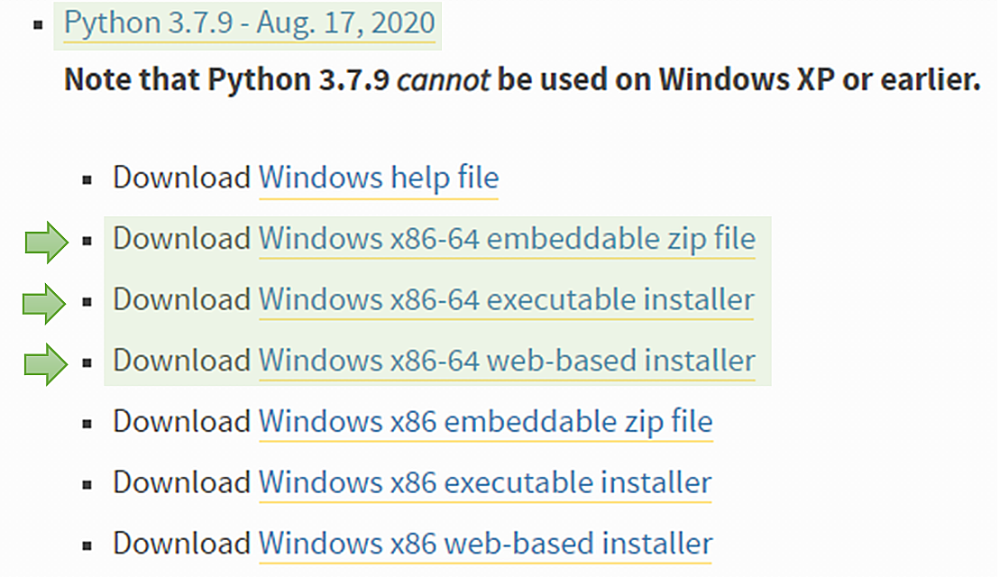
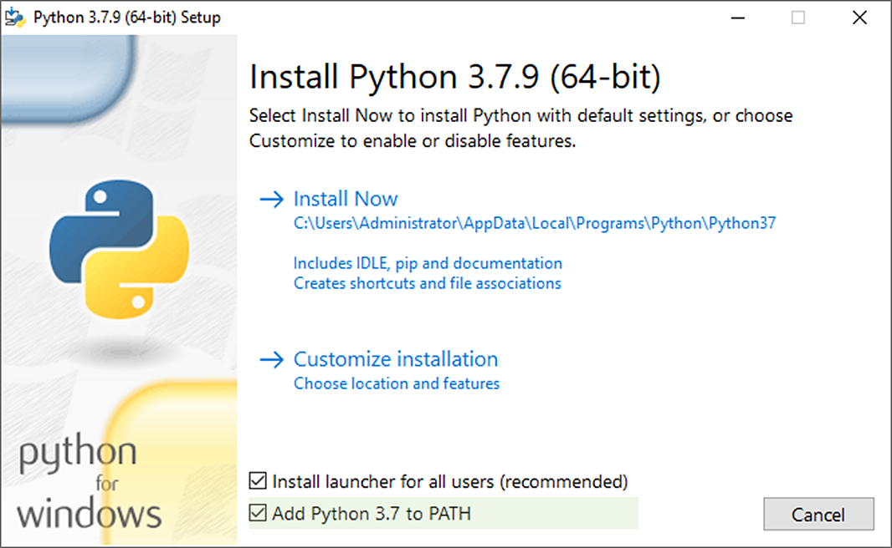
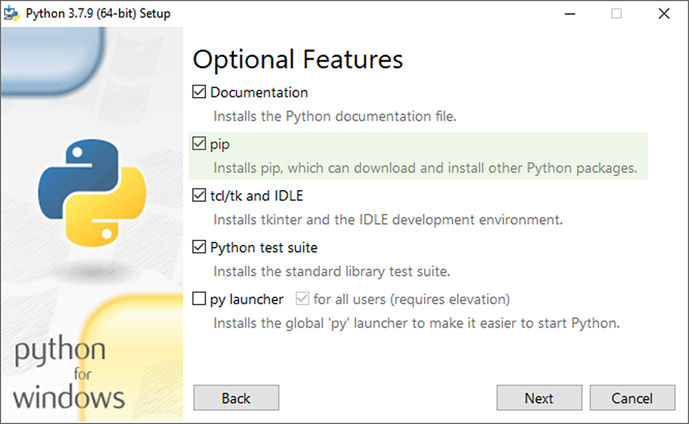
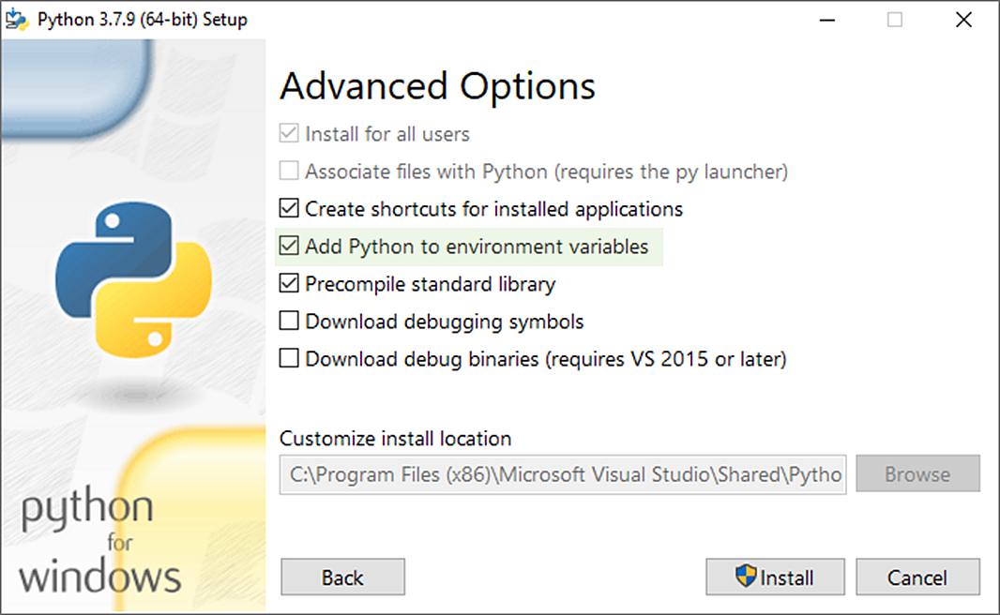
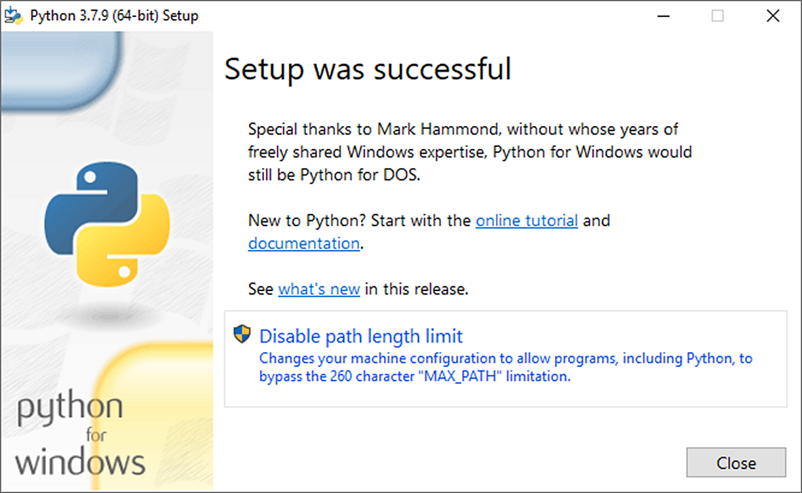
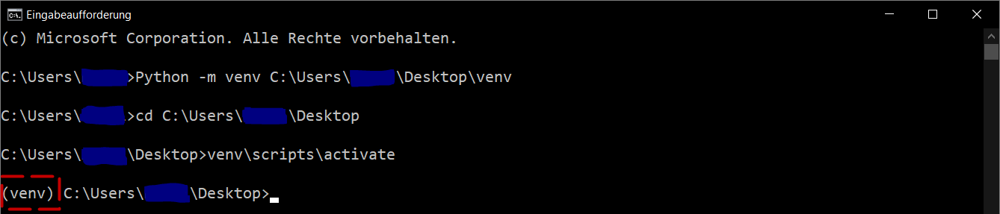
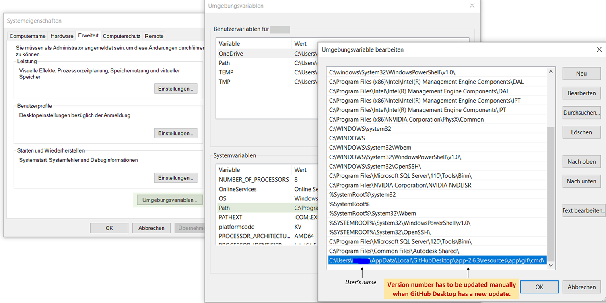
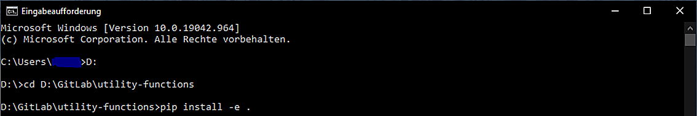
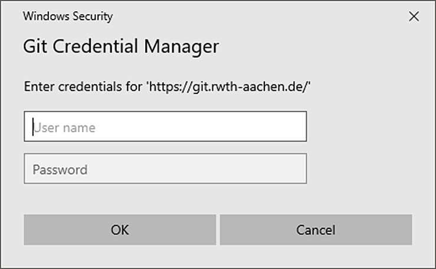
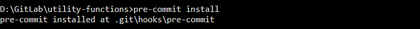

.. _install:

Installation
============

Installation of Python
######################

If you do not already have it, install Python (64 Bit) on your device. We recommend a version between 3.6.8 and 3.8.10. Newer versions should also work; however, they have not been tested in this context yet.
The installation is below illustrated choosing Python 3.7, 64 Bit. You can install Python for Windows from `python.org <https://www.python.org/downloads/windows/>`_ (e.g., an installation of Python 3.7.9).

   Possible download files to choose

Do not forget to add Python to the environment variables of the device (in other words: Add Python to PATH). You should also install pip.

|bild1| |bild2|
|bild3| |bild4|

.. note::
    This guide does not fully apply when you are using **Anaconda**. In such a case, Anaconda must not be combined with a normal Python version. In addition, a workaround may have to be found for many following executions, such as the *pre-commit install*.

.. note::
	It is recommended to install the utility functions in a **virtual environment** so that the installed package versions do not conflict with other Python-related activities on the computer.

(Recommended) Installation of a virtual environment
####################################################

A **virtual environment** is a Python environment in which the Python interpreter, libraries, and scripts installed in it are isolated from those installed in other virtual environments, and (by default) from any libraries installed in a "system" Python (a Python installed as part of your operating system).

In order to use a virtual environment, it must first be created in an arbitrary directory on the computer. Open cmd and write the following command.

.. code-block:: console
	:emphasize-lines: 1

	Python -m venv <<yourArbitraryDirectory>>\venv

.. code-block:: console
	:caption: Example

	Python -m venv C:\Users\user1\Desktop\venv

Next, navigate to your chosen directory and activate the virtual environment as follows:

.. code-block:: console

      venv\scripts\activate

The creation and activation of the environment can look like this:

   Activate virtual environment

This red marked *(venv)* is prefixed to the commands as long as the virtual environment is activated. The cmd commands in the following chapters can be executed in the virtual environment without any adjustments. The only difference of your cmd to the pictures will be the prefix *(venv)*.

.. note::

	IDEs like e.g. Pycharm can also create a virtual environment for you.

Installation of Project ETA Utility Function
############################################

This section explains how to install the ETA Utility Functions. You can install Utility Functions for **usage-only** or as a **developer**.
In addition to the basic tool, it is also possible to install two different extensions: the **ETA-X extension** and the **development extension** (only for developer option).

Usage-Only option
*****************

//TODO: Update and check if that is right

Installation with pip out of git repository:

.. code-block:: console

   pip install eta_utility@ git+https://.....

Or local file:
Open cmd and navigate to the directory where the utility-functions folder is located.
The package can be installed via pip using:

.. code-block:: console

   pip install .

If you need to use ETA-X agents or environments, specify install option “eta_x”.

.. code-block:: console

   pip install .[eta_x]

Developer option
****************

As a developer, you first have to create a connection to the respective GitLab project before installing utility functions.

Installation of Git and cloning the repository
----------------------------------------------

If you do not already have it, install Git on your device. For Windows, you can download it from `git-scm.com <https://git-scm.com/download/win>`_. Alternatively, it is also possible to use Git programs such as GitHub Windows or `GitHub Desktop <https://desktop.github.com/>`_.

If you already use GitHub Windows or `GitHub Desktop <https://desktop.github.com/>`_, you already have Git on your device, but Git will not necessarily be assigned to PATH.
In this case, you can skip the first Git-download from above and just add the path of git.exe to your environment variables by yourself (here is shown the path for git.exe in GitHub Desktop 2.6.3 added to the SYSTEM variables):

   Adding git to PATH

In case of any problems with the location of git.exe on your device, `this <https://stackoverflow.com/questions/11928561/where-is-git-exe-located>`_ discussion might help.
After that, clone the repository of the git project on your device.

Installation of ETA Utility Functions
-------------------------------------

For the next steps, open cmd.

.. warning::
    Depending on where the relevant folders for the installation are located on your OS, cmd may need to be run as administrator.

In case you haven't updated for a while, you might update the most important parts (pip and setuptools) beforehand. Write these commands in cmd:

.. code-block:: console

   Python -m pip install --upgrade pip
   pip install --upgrade setuptools

After this, go to the root directory of the Git project and install the project using:

.. code-block:: console

   pip install -e .

It might be that you will be asked again for your Git-Login.

This installation can take a while.

(Optional) Installation of Extensions
-------------------------------------

The extensions (Development and ETA-X) can be installed instead of the normal installation (see above) or on top of it. They differ from the normal installation in the installation command and in their features. You may need to follow other required commands after their installation.

*➤Development Extension*
^^^^^^^^^^^^^^^^^^^^^^^^^

The Development extension is needed if you want to use pre-commit, run Python tests, or contribute to the documentation (for the latter see also :ref:`Editing this documentation`).
For a developer, it is recommended to install this extension.

For installing the development extension, write:

.. code-block:: console

   pip install -e .[develop]

in the command line.

Finally, do not forget to execute the following:

.. code-block:: console

   pre-commit install

before performing the first commits to the repository. This ensures that all pre-commit scripts will run correctly.

.. note::

   If this comes up instead, you probably did not properly mapped the PATH of git in your system variables (see :ref:`Installation of Git and cloning the repository`):

   .. image:: Pictures/12_ErrorGitNotAddedToPath.jpg
       :width: 700
       :alt: git not added to PATH

.. note::

   The installation within a virtual environment looks exemplary as follows:

   .. image:: Pictures/13_InstallWithVE.PNG
       :width: 700
       :alt: installation within a virtual environment

   Please note: In the image view the pre-commit installation is missing, which should follow directly after the development extension installation.

*➤ETA-X Extension*
^^^^^^^^^^^^^^^^^^^

ETA-X Extension is required to enable the optimization functionality within the eta-x module of this package. If you need to use ETA-X agents or environments, specify the installation as follows.

For installing the ETA-X extension, write:

.. code-block:: console

   pip install -e .[eta_x]

in the command line.

Epilogue
--------

To edit the code efficiently, install an IDE for Python (e.g., PyCharm, Visual Studio Code or Visual Studio Community).
If you want to know if the installation was successful, you can run the tests in the *utility-functions* ➔ *test* folder. (These tests also run automatically on each git commit/push.)
