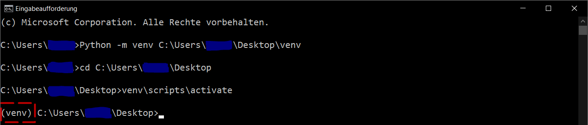

.. _install:

Installation for Users
================================================

This section explains how to install the ETA Utility Functions for usage only. For instructions
what to consider during the installation process if you want to contribute to development of
the utility functions, please see the development guide :ref:`development`.

You can install the basic package (without *eta_x*) or the entire library, both options are
shown below.

.. _create_virtual_environment:

Creating a virtual environment (recommended)
-----------------------------------------------------

A **virtual environment** is a Python environment which isolates its Python interpreter, libraries,
and scripts installed. It's isolated from other virtual environments, and (by default)
from any libraries installed in the "system" Python (the main Python environment installed on your
operating system). This isolation prevents conflicting libraries or versions from affecting each other.

In order to use a virtual environment, it must first be created in an arbitrary directory
on the computer. Open a terminal (for example cmd or PowerShell on Windows) and execute the
following commands.

.. code-block:: console

    $ python -m venv <Any folder>/.venv

Navigate to your chosen directory, then activate the virtual environment:

.. code-block:: console

    $ .venv/scripts/activate

The creation and activation of the environment are shown in the following figure.

   Create and activate virtual environment.

When the virtual environment is activated, *(.venv)* is prefixed to the console line.
The commands in the following chapters can be executed in the virtual environment without
any adjustments.

.. note::

   Some IDEs (Integrated Development Environments) such as PyCharm or code editors like VS Code
   will automate the activation of the virtual environment for you.

Installation via pip
------------------------------

You can install `eta_utility` using pip:

.. code-block:: console

   $ pip install eta_utility

It's recommended to install the package in a virtual environment. See :ref:`create_virtual_environment`

.. note::

   ETA-utility supports Python versions between 3.9 and 3.11 (inclusive).

There are multiple classes of optional requirements. If you would like to use some of the optional components, please install one or more of the following:

- *eta-x*: Contains dependencies for the optimization part of the framework
- *examples*: Dependencies required to run the examples
- *develop*: All of the above and additional dependencies for the continuous integration processes. Required when performing development work on eta_utility.

The optional requirements can be installed using pip. For example:

.. code-block:: console

   $ pip install eta_utility[eta-x]

.. _install_julia:

Using Julia Extensions
-------------------------------------

First, it is necessary to have julia available in your system, the recommended version
is the latest stable version but minimum v.1.8 (`download julia <https://julialang.org/downloads/>`_).

If your hardware has no installation rights, use the Windows Package Manager **winget**. Open the terminal and run the following command for the Windows operating system:

.. code-block::

    $ winget install Julialang.Julia --version [version_number]

Next, it's important, that you include Julia to the operating system path. For windows 10 do the following steps:

- **1st step**: Open run (Windows Key + R) and write ``rundll32 sysdm.cpl,EditEnvironmentVariables`` .
- **2nd step**: Under either "User Variables" or "System Variables", the row "Path" add with "edit" the Julia path. The Julia
  path should have the following schema: ``C:Users\User\AppData\Local\Programs\Julia-1.8.5\bin``.
- **3rd step**: Click OK and restart eta-utility.

If you are using a different operating system, look here: (`path julia <https://julialang.org/downloads/platform/#windows>`_)

The next step is to activate your virtual environment for the eta-utility
and inside the eta-utility directory execute the following command:

.. code-block::

    $ install-julia

Make sure to install Julia using the same Python virtual environment that you are using to execute your code.

This command will install PyJulia, configure PyCall in your system, and install the Julia extensions package (ju_extensions) from eta_utility.
