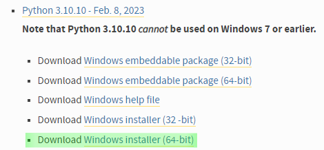
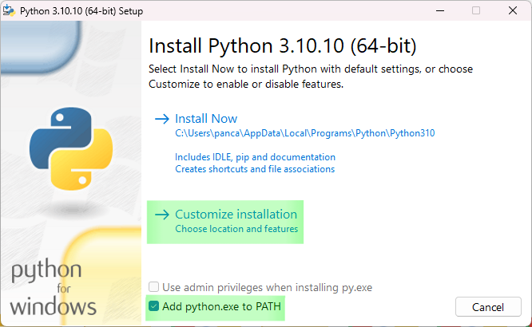
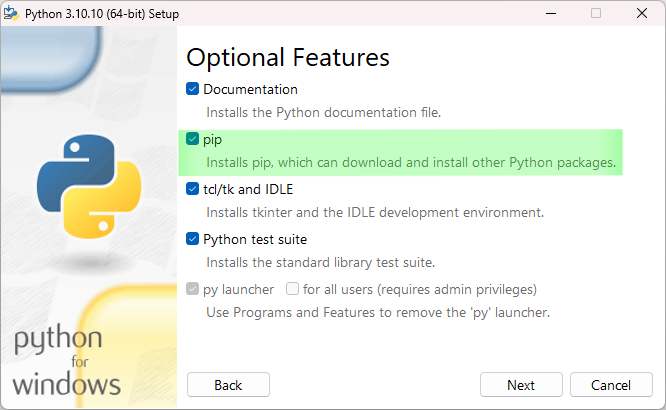
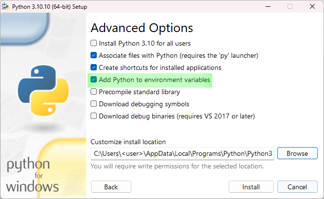
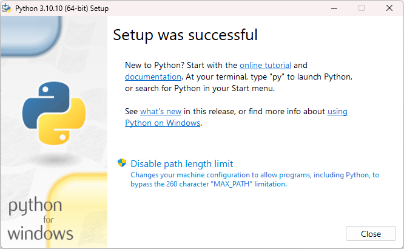

.. _python_install:

Set up Python and Git
======================

This section explains how to set up Python and Git. Additional information can be found in the `Beginner's Guide to Python (external link) <https://wiki.python.org/moin/BeginnersGuide>`_.
If you have already set this up, you can go to the :ref:`install` or :ref:`development` sections.

Installation of Python
------------------------

If you do not already have it, install Python (64 Bit) on your device. ETA_utility supports Python versions between
**3.9** and **3.11**.

Below, the installation is illustrated using Python 3.10.10, 64 Bit. You can install Python for
Windows from `python.org <https://www.python.org/downloads/windows/>`_

   Selection of download files from python.org.

When installing, select the "Add Python to PATH" option and also make sure that "pip" is installed.
In addition to this, it typically makes sense to "Add Python to environment variables" which allows
other programs to find it. The setup process and selected options are shown in the following
figures.

|bild1| |bild2|
|bild3| |bild4|

.. note::
    Using **Anaconda** is not supported and can lead to weird errors. Especially Anaconda should
    not be combined with a version of CPython on the same machine.

.. _install_git:

Installation of Git
----------------------------------------------

If you do not already have it, install Git on your device. For Windows, you can download
it from `git-scm.com <https://git-scm.com/download/win>`_. Alternatively, it is also
possible to use GUIs (Graphical User Interfaces) for git such as SourceTree or `GitHub Desktop <https://desktop.github.com/>`_. If you have problems with git, see the :ref:`faq`.
